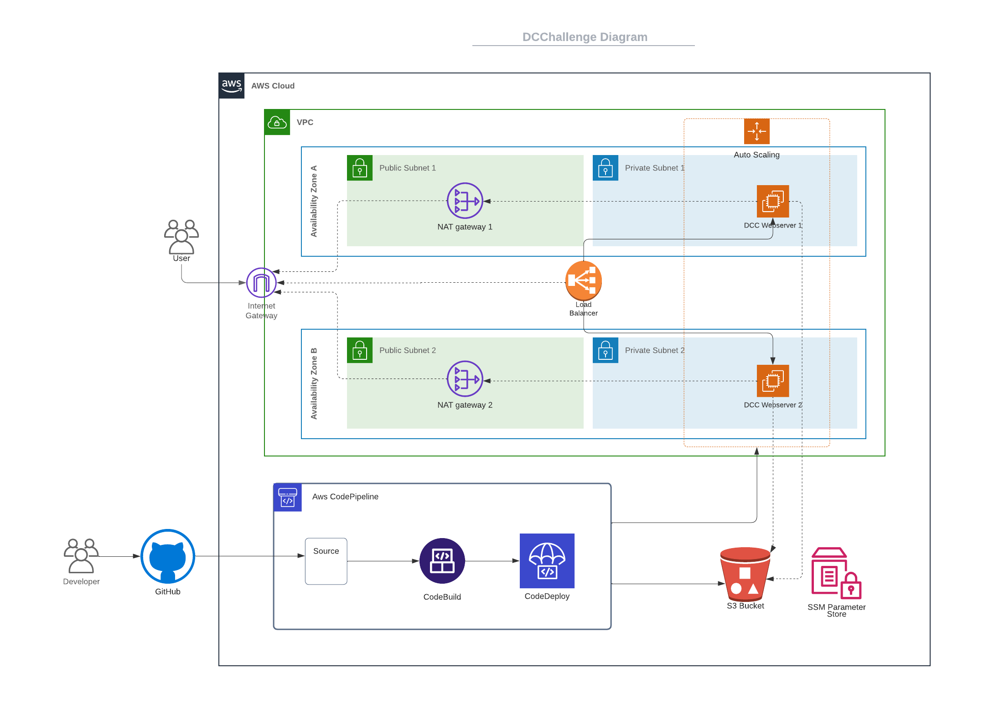

# DCChallenge




This project is about setting up a highly available web server on EC2 using Docker containers, ECR, Infrastructure as Code (IaC), automation, and pipelines. I call the project **DCChallenge** or **DCC**, which stands for "Devops Code Challenge".

You can see the project diagram above. Monitoring and ‌‌Bastion are considered in the project but have not been implemented yet.

## Contents
1. **Project Structure**
2. **Configuring AWS CLI**
3. **Project Setup**
4. **Project Deployment**
5. **Delete Project**
6. **Troubleshooting**

### 1. Project Structure
The project follows this directory structure:

``` bash
.
├── ansible_role
├── appspec.yml
├── cloudformation
├── images
├── LICENSE
├── README.md
├── scripts
└── webserver

```

- **ansible_role** folder: This directory contains Ansible roles for the project. You can list and tag the project roles in the main YAML file, site.yml. Add a host to the project by editing the host file.
- **cloudformation** folder: Houses CloudFormation templates to configure the required services for this project.
- **images** folder: Stores images needed for this guide.
- **scripts** folder and **appspec.yml**: Used by AWS CodeDeploy service. Modify these files if you need to change the deployment process.
- **webserver** folder: Contains the project's main **Dockerfile** and **index.html**(webserver context).

### 2. Configuring AWS CLI
For this project, you can use either the AWS CloudFormation console or the AWS CLI. This guide uses the AWS CLI, which you must have installed on your system. After installation, configure it with your AWS credentials.

If you work with multiple AWS accounts, leverage AWS profiles - a set of settings including credentials and other AWS related info. Create a new profile with the command aws configure --profile profilename, where profilename is your profile name.

For example:

``` bash 
aws configure --profile <project profile name>

```
Input your details as follows:
``` bash 
AWS Access Key ID [None]: YOUR_ACCESS_KEY
AWS Secret Access Key [None]: YOUR_SECRET_KEY
Default region name [None]: YOUR_REGION (e.g., us-west-2)
Default output format [None]: json

```

### 3. Project Setup

To set up the project for the **first time**, you will need to run the following commands:

1. Navigate to the main project folder. You need to assign values to the parameters defined inside file **DCC-cf-template-<date>.yml** ".

You have two options for doing this, 

  - define separate file for Parameter (pass it to the command with **--parameters file://parameters.json** option in awscli).
    
  - update default values in the main template alternatively.
   
2. execute the following command:

``` bash 
aws cloudformation create-stack --capabilities CAPABILITY_NAMED_IAM --stack-name <stack name> --template-body file://cloudformation/DCC-cf-template-2023-07-26.yaml  --profile <project profile name > --region <project region>
```

> Note: This project template is currently set up for regions **eu-central-1** and **eu-north-1**.

3. After running the command, you can monitor the status of the stack until the entire project is up. You can do this either through the AWS console or by executing the following command:

``` bash 
aws cloudformation describe-stack-events --stack-name <stack name> --profile <project profile name >  --region <project region>

```

4. After the stack is fully up and running, to **update** it ,you should use the following command:

```bash 
aws cloudformation update-stack --capabilities CAPABILITY_NAMED_IAM --stack-name <stack name> --template-body file://cloudformation/DCC-cf-template-2023-07-26.yaml  --profile <project profile name> --region <project region>

```

#### Important notes:

1. On the first launch of the infrastructure, the server may not function due to the repository being empty. Therefore, it's essential to run a deployment immediately after the execution to start the servers.

2. The webservers are launched in a private subnet. Therefore, there's no direct access to them from the outside (Internet). To connect to them, you either need to use a previously accessible bastion server or utilize the **AWS SSM Session Manager**.

3. All prerequisites required on the webservers are prepared via the **userdata** script included in the CloudFormation template.
  
5. A cron job runs every 5 minutes on the servers to monitor the status of the containers.

6. The keys and secrets of the project are stored on the **SSM Parameter Store** and are readily accessible.

7. Artifacts and temporary files of the project are stored on an project **S3 bucket**.

### 4. Project Deployment

To deploy the project, you can commit to the **main branch** of the project repository. The repository will be updated automatically, and the containers on the servers will also be updated.

The project branch is customizable, and you can modify it in the CloudFormation template (**GitHubBranch** parameter).

To Change the displayed context, you can update the **"webserver/index.html"** file.

### 5. Delete Project 
To delete the stack, the S3 bucket related to the project must be cleared beforehand. In addition, the service roles created by the stack and the repository should be deleted too.

``` bash
aws cloudformation delete-stack --stack-name <stack name> --profile <project profile name> --region <project region>
```

Note: Before deleting the stack, make sure you have backed up all the essential project data that you may need to refer to in the future.

### 6. Troubleshooting

- **Error 502:** If you see a 502 Bad Gateway error on your browser, this indicates that your web server(EC2 instances) have been launched, but the container hasn't started correctly, and the service isn't operational. To resolve this issue, verify that the deployment has been correctly executed and that docker-compose is running ('up').

- **Error 504:** If you see a 504 Gateway Time-out error on your browser, it means that there are no instances present behind your load balancer. In this scenario, ensure that the auto-scaling is functioning correctly.

- **Userdata Log:** You can find the userdata script(bootstapt)'s logs at the following path: "/var/log/init.log".

- **Image not found:** If, during the EC2 startup, you observe the following message in the **/var/log/init.log**, it signifies that this is the first time the project's stack is being executed and there are no images present in the repository(ECR) or the repository images be removed. To resolve this problem, you need to deploy the project once:

```bash
[2023-07-26 16:51:38] Error response from daemon: manifest for *********.dkr.ecr.eu-central-1.amazonaws.com/dcchallenge-prod:latest not found: manifest unknown: Requested image not found
[2023-07-26 16:51:38]   [ERROR]Requested image not found
```
